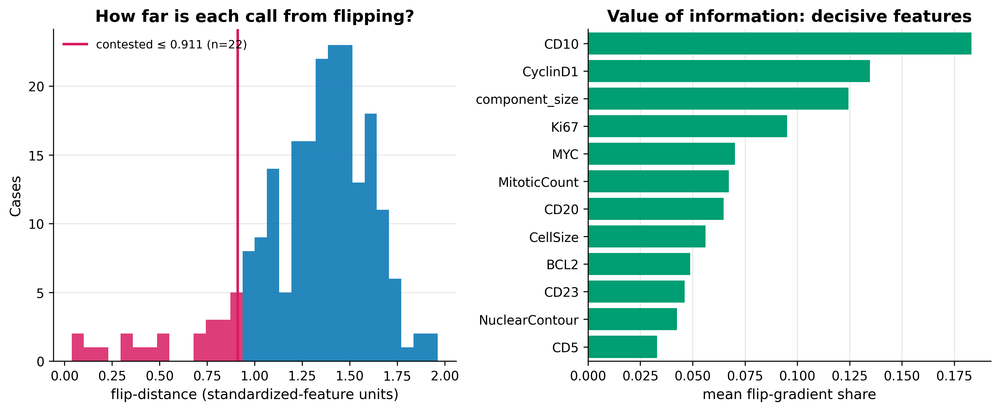

# EpiNet — the Epistemic Network toolkit

[](https://github.com/heidihelena/epinet/actions/workflows/tests.yml)
[](LICENSE)

[](https://doi.org/10.5281/zenodo.20681072)

EpiNet is Vahtian’s research-methods demonstrator for graph-shaped biomedical data.
It produces calibrated, caveated, provenance-rich analysis reports. It is not clinical decision support.
CiteVahti checks claim-evidence support in manuscripts.
EpiNet checks whether graph-shaped analytical claims survive basic methodological stress tests.
Both share the same brand principles: human review, provenance, caveats, and no unsupported claims.

EpiNet is a **transparent node/edge network and feature-space analysis toolkit**
for graph-shaped datasets. The name reads *Epistemic Network*: the core question
is not just "what does the model predict" but how well-founded each call is — how
contestable, how calibrated, how well it transports. You load entities and
relationships from CSVs and it computes graph features, *honestly* evaluates an
outcome model, finds shortest paths, clusters nodes by feature-space centroid,
and scores how **contestable** each call is — with publication-quality figures
and a model card. Epidemiology is one use case; the core is domain-neutral
(driven through lung-cancer quality indicators, lung-nodule risk, and lymphoma
subtyping).

> **Scope.** This is a **research and education demonstrator, not clinical or
> public-health decision support.** Any model it produces must be validated on
> independent, outcome-linked data before it means anything clinically. See
> [Scope and caveats](#scope-and-caveats).

What distinguishes EpiNet from a thin scikit-learn wrapper is that **honest
evaluation is the default path**: a label-permutation null, calibration, and
(where appropriate) community-aware splitting run alongside the headline metric,
so a good score reflects real signal rather than leakage or chance. Developed as
part of **Vahtian**; MIT licensed.

**Jump to:** [About](#about-this-project) · [What it does](#what-it-does) ·
[Install](#install) · [Quick start](#quick-start) ·
[What it looks like](#what-it-looks-like) ·
[EpiNet Workbench](#epinet-workbench) · [Documentation](#documentation) ·
[Scope and caveats](#scope-and-caveats) · [Tests](#tests-and-linting) ·
[Citation](#citation) · [License](#license)

## About this project

EpiNet began a few years ago as a personal Python coding project and has grown
into a research-methods demonstrator with one organizing principle: **honest
evaluation is the default, not an afterthought.** Where most modelling code
optimizes a headline number, EpiNet is built to resist fooling itself — a
label-permutation null, calibration, bootstrap intervals, and community-aware
splitting run alongside every headline metric; contestability makes each call
inspectable; and the federated layer shares findings across sites without
pooling records. The name reads as *Epistemic Network*: the question is not just
what the model predicts, but how well-founded each call is. It remains a
**research and education demonstrator — not clinical decision support.**

## What it looks like

<details>
<summary><b>Screenshot — the contestability lens on a lymphoma cohort</b></summary>



*The contestability lens on the lymphoma grey-zone example. Left: how far each
call is from flipping, with the most-contested tail shaded. Right: value of
information — the features that most drive boundary flips (CD10, cyclin D1,
Ki67, …). The same lens runs on any cohort. More figures in
[examples/sample-outputs/](examples/sample-outputs/).*

</details>

## What it does

- **Graph features** — degree, weighted degree, clustering, component size,
  isolate flag, optional betweenness/closeness/PageRank.
- **Honest outcome model** — RandomForest over graph features + node attributes,
  with discrimination (AUROC, AUPRC), classification (balanced accuracy, MCC, F1),
  **calibration** (Brier always; slope/intercept for binary outcomes), bootstrap CIs, permutation importance,
  a label-permutation null, community-aware splitting, small-cohort warnings, a
  reproducibility `provenance` block, and a TRIPOD+AI-flavoured `model_card.md`.
- **Shortest paths** — from sources to target nodes or target-outcome nodes, with
  per-target coverage.
- **Feature-space clustering** — k-means centroids + per-node distance to each
  outcome-class centroid (Euclidean or Ledoit–Wolf-shrunk Mahalanobis).
- **Contestability** (`--run-contest`) — the closed-form smallest feature-space
  move that flips a node's nearest-centroid class, plus a per-feature
  value-of-information ranking. See [docs/methods.md](docs/methods.md).
- **Input normalization** — maps common column aliases onto the schema before
  validation; never silently (every rename logged, raw + normalized hashed).
- **Federated pipeline** — reconstruct the scaler, centroids, and contestability
  from per-site aggregates only, behind a fail-closed governance gate. See
  [docs/federated.md](docs/federated.md) and
  [docs/governance-and-consent.md](docs/governance-and-consent.md).
- **Baselines & external validation** — compare graph features against a
  node-embedding baseline and a no-information floor under the same harness, and
  validate a model on an independent cohort. See [docs/validation.md](docs/validation.md).
- **LLMvahti** (*experimental*) — the same contestability lens pointed at
  LLM-as-judge verdicts: a blinded-second-rater audit where the human rates
  first, with bootstrapped inter-rater agreement, judge-confidence calibration,
  and per-verdict flip-distance over rubric criteria. Run it with the
  `epinet-llmvahti` command (`--human`/`--judge` CSVs); see
  [docs/llmvahti.md](docs/llmvahti.md).

## Install

```bash
pip install -e .            # installs the package + the `epinet` command
pip install -e ".[dev]"     # also pytest + ruff + hypothesis (for development)
pip install -e ".[lidc]"    # pylidc, for the LIDC-IDRI / LUNA16 examples
pip install -e ".[excel]"   # xlrd + openpyxl, for the TCIA diagnosis spreadsheets
```

`requirements.txt` lists the core runtime dependencies if you prefer not to
install the package.

## Quick start

```bash
epinet \
  --nodes synthetic_nodes.csv \
  --edges synthetic_edges.csv \
  --outcome-column Outcome \
  --target-outcome 1 \
  --output-dir epinet_outputs
```

(`epinet ...` is the installed console command; `python -m epinet.toolkit ...`
works identically without installing.) This runs graph-feature generation, an
honestly-evaluated outcome model, and shortest-path summaries side by side.

Key outputs in `epinet_outputs/`:

- `model_metrics.json` — discrimination, classification, calibration,
  `iteration_summary`, bootstrap CI, permutation test, data warnings, provenance
- `model_card.md` — TRIPOD+AI-flavoured human-readable model card
- `model_feature_importance.csv` — permutation importance (± `importance_std`)
- `node_features.csv`, `shortest_paths.csv`, `nearest_targets.csv`,
  `target_coverage.csv`, `provenance.json`, `run_summary.json`
- `plots/*.png` — network, calibration, learning curve, metric stability,
  confusion matrix, and more (see [docs/methods.md](docs/methods.md))

The data format is documented in [Data-format.md](Data-format.md).

## EpiNet Workbench

<details>
<summary><b>Local CSV-to-report interface — plan → run → optional UI</b></summary>

EpiNet Workbench is a local CSV-to-report interface. It does **not** replace the
command line and it is **not** AutoML: it never searches models or chases a
metric. It writes an `analysis.yaml` file and runs the *same* EpiNet engine as
the CLI, so every interactive run is reproducible without the interface.

```bash
# 1. Plan: profile the data, infer a schema, write a reviewable config
epinet-workbench plan --nodes synthetic_nodes.csv --edges synthetic_edges.csv \
  --outcome Outcome --output analysis.yaml

# 2. Run: execute the plan and write a portable result bundle
epinet-workbench run --config analysis.yaml

# 3. UI (optional): the same plan/run behind a local Streamlit workbench
pip install -e ".[ui]"
epinet-workbench ui
```

The config — not hidden UI state — is the source of truth. The five-screen UI
(Data → Schema → Plan → Run → Report) only ever builds an `analysis.yaml` and
calls the same runner.

**Supported modes**

1. **Single CSV** — feature-space analysis for an ordinary table (no network
   inference claimed unless you opt into a similarity graph).
2. **Nodes + edges** — the full graph pipeline on real graph-shaped data.
3. **Development + validation** — runs external validation by default; the mode
   for publishable work.

**Safety gates** block runs that would produce nonsense (no/single-class
outcome, ID used as a feature) and warn on the rest (suspected outcome leakage
selected as a feature, missing validation cohort, identifier-looking columns). A
too-small positive class downgrades model training to a descriptive report
rather than fabricating metrics.

**Scientific claims check.** Every run distils its diagnostics into
plain-language claim gates — written into the model card, `claims_check.json`,
and the HTML report:

- **Permutation null** — *signal above null* vs *signal not detected*.
- **Split sensitivity** — random vs community-aware split, to expose a headline
  that leaned on leakage between connected cases.
- **Baseline floor** — does the model beat the no-information baseline? The
  margin is measured *paired per split* (model and floor share the same splits),
  with a Nadeau–Bengio-corrected interval, so the verdict is three-way: *beats
  floor*, *at floor*, or *not resolvable at this n* when the interval straddles
  the line and the data cannot yet say.
- **External validation** — run or not, and how far performance transported.
- A standing *"do not claim clinical utility unless…"* caveat, generated into
  every report and not removable by theming.

**Branded HTML report.** `epinet-workbench run` also writes a self-contained,
offline `index.html` into the bundle (summary, caveats, claims check, model card,
metrics, calibration, permutation null, baselines, contestability, plots,
provenance, CSV downloads) — the portable artifact to share or print to PDF. A
theme block in `analysis.yaml` sets the brand, title, logo, colours, and plot
palette (slide between the colourblind-safe **Wong** and the Vahtian **Sentinel**
palettes) — but the caveats, claims check, and provenance are always rendered:

```yaml
reporting:
  brand_name: "Vahtian / EpiNet"
  report_title: "EpiNet Analysis Report"
  logo_path: null
  primary_color: "#5E4F99"
  accent_color: "#8273C0"
  plot_palette: "wong"   # or "vahtian"
```

**Outputs** (the downloadable result bundle):
`index.html`, `analysis.yaml`, `model_metrics.json`, `model_card.md`,
`claims_check.json`, `split_comparison.json`, `provenance.json`,
`node_features.csv`, `node_contestability.csv`, `model_feature_importance.csv`,
`baseline_comparison.csv`, `external_validation.json` (publication mode),
publication-quality `plots/`, and `environment.txt`.

**Scope:** research and education only. Not clinical decision support.

</details>

## Documentation

<details>
<summary><b>Docs index — methods, examples, federated, governance, validation</b></summary>

- **[docs/methods.md](docs/methods.md)** — evaluation design (iterative
  evaluation, permutation null, community-aware splitting), the diagnostic
  figures, the contestability theory, and methodological boundaries.
- **[docs/examples.md](docs/examples.md)** — worked examples: shortest paths,
  the CiteMatch evidence graph, feature-space clustering, the pulmonary-nodule
  cohort, real LIDC-IDRI, and the Nordic lung-cancer quality-indicator network.
- **[docs/federated.md](docs/federated.md)** — the federated fit, federated
  contestability, the registry adapter, and the sealed-egress model.
- **[docs/governance-and-consent.md](docs/governance-and-consent.md)** — what the
  governance gate enforces vs what remains a policy/legal responsibility
  (explicitly non-legal).
- **[docs/validation.md](docs/validation.md)** — representation baselines (incl. a
  node-embedding comparison) and external validation: does the model transport?

Each worked example also has a builder script and a walkthrough under
`examples/*_usecase.md`; the federated and governance pipelines have runnable
demos under `examples/federated_*` and `examples/governance_*`.

</details>

## Scope and caveats

<details>
<summary><b>What EpiNet does <i>not</i> do, and what to add before any real-world use</b></summary>

The model is intentionally simple. It does **not** infer causality, outbreak
dynamics, clinical risk, or intervention effects. Network features can be useful
descriptors, but they can also encode sampling bias, measurement bias, and
structural confounding. **Use the outputs as exploratory evidence, not as
decisions.**

Before using EpiNet for health, education, welfare, employment, or public-sector
decisions, add: domain-specific data validation; directed/temporal assumptions;
uncertainty and sensitivity checks; external validation on independent
outcome-linked data; privacy and governance review; and human review of any
operational recommendation. The bundled cohorts are synthetic or small and
selection-biased — see the per-example limits in [docs/examples.md](docs/examples.md).
For clinical prediction, align reporting with
[TRIPOD+AI](https://doi.org/10.1136/bmj-2023-078378); for AI interventions, the
bar moves toward prospective evaluation (e.g. CONSORT-AI).

</details>

## Tests and linting

<details>
<summary><b>How to run the tests and the linter</b></summary>

```bash
python -m unittest discover -s tests   # or: pytest  (adds the hypothesis property tests)
ruff check .
```

GitHub Actions runs both on every push and pull request across Python
3.10–3.12 (`.github/workflows/tests.yml`).

</details>

## Citation

<details>
<summary><b>How to cite EpiNet</b></summary>

If you use EpiNet, please cite it via [`CITATION.cff`](CITATION.cff) (GitHub's
"Cite this repository" button generates APA/BibTeX from it).

</details>

## License

MIT. See `LICENSE`.
