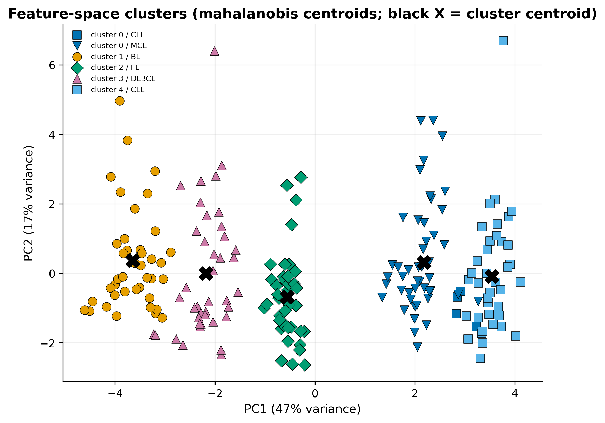
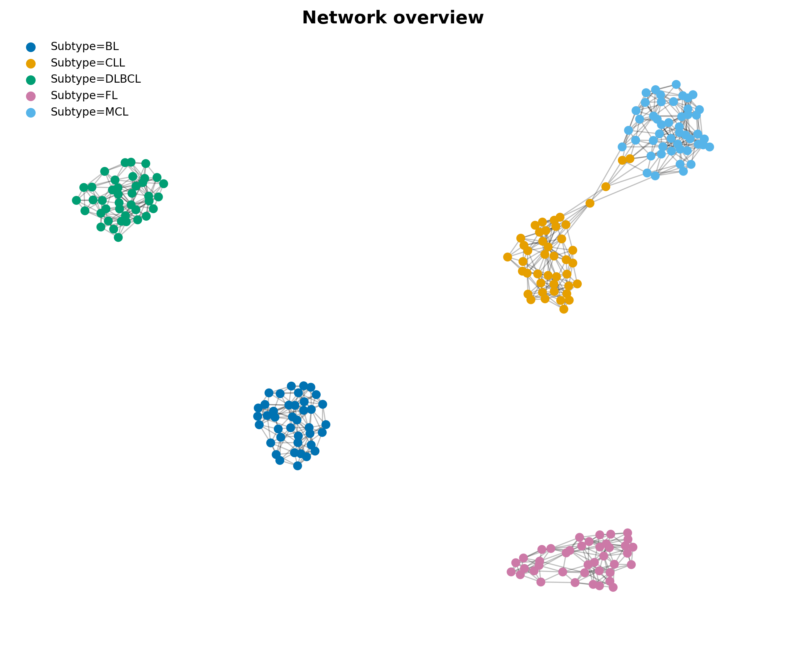
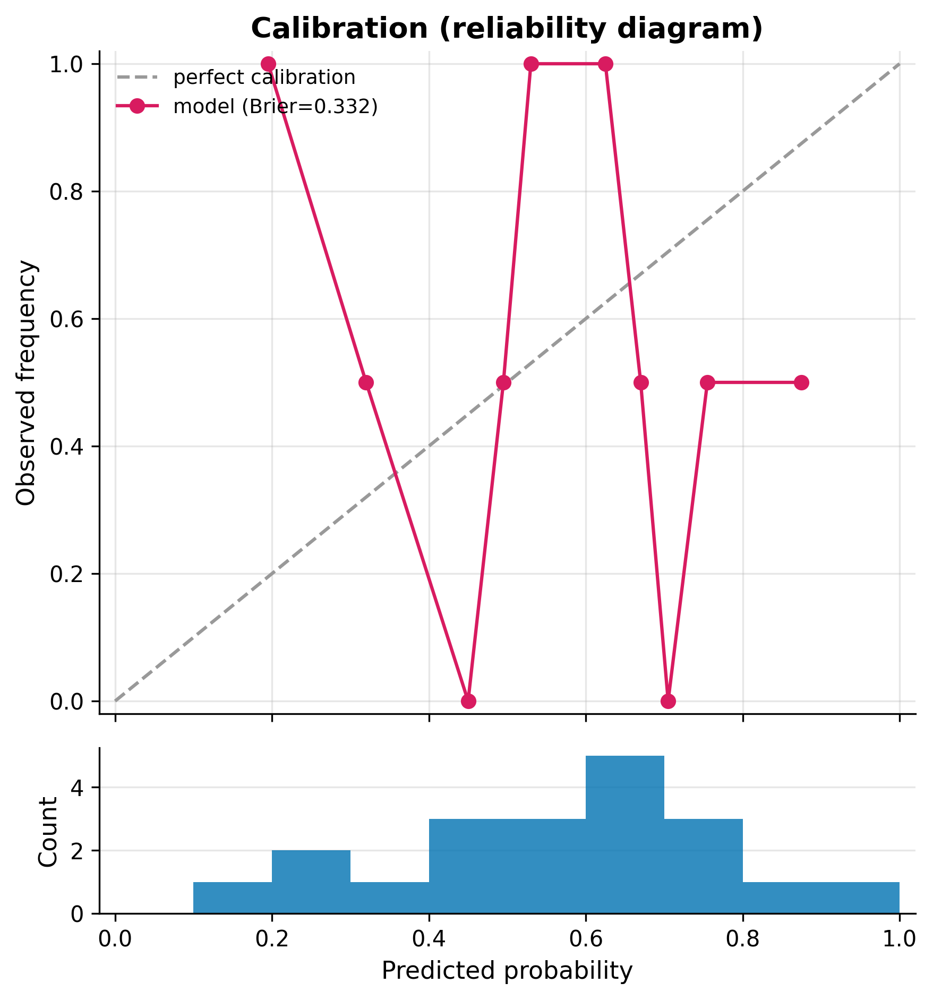
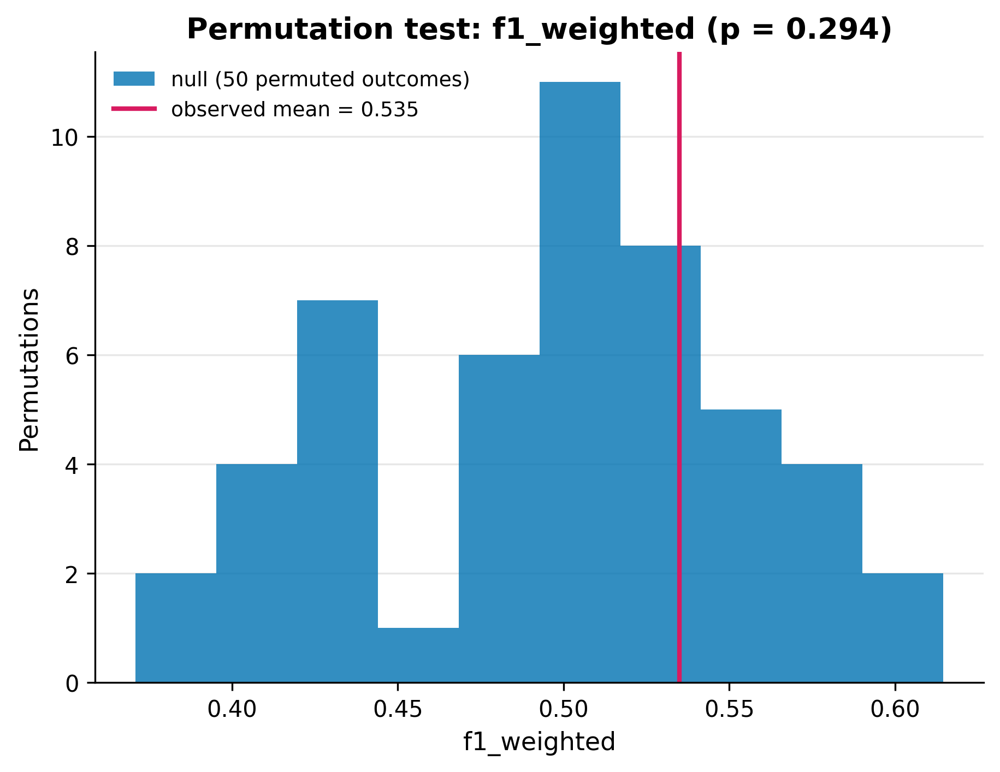
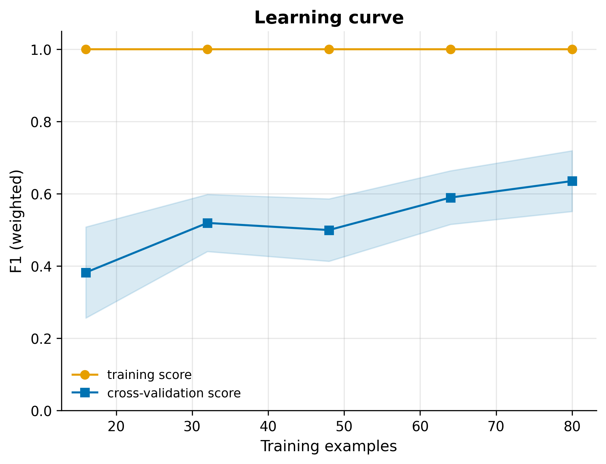
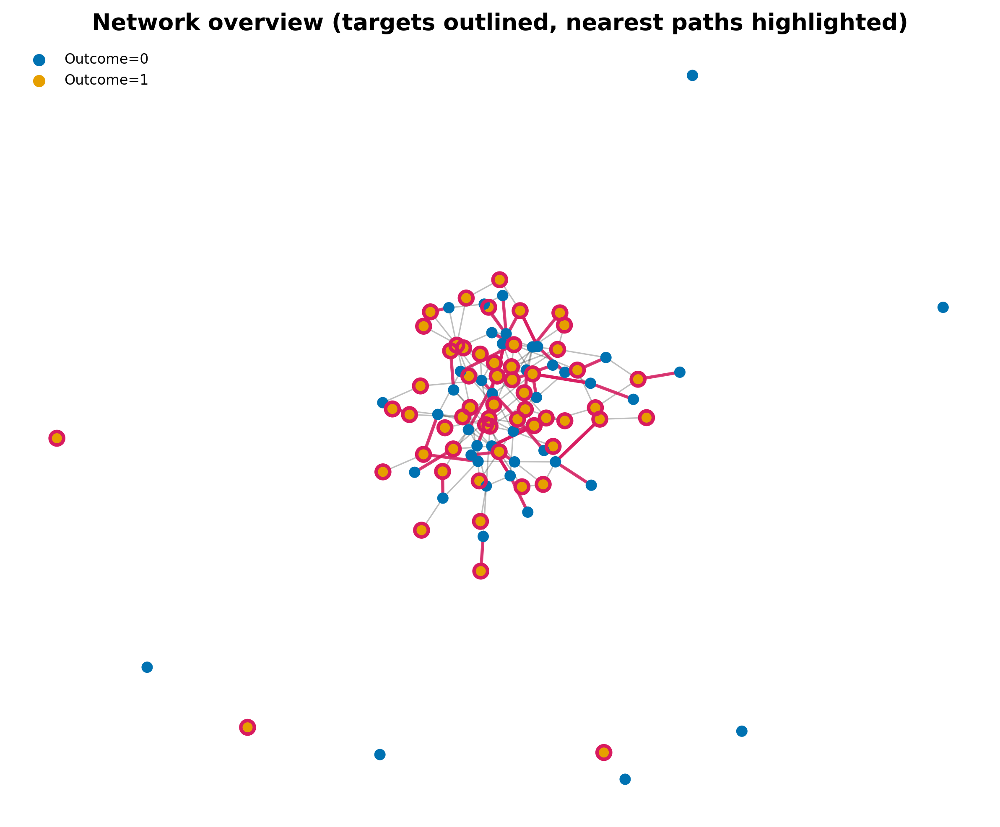

# Sample outputs (frozen)

Representative `epinet` figures and reports, committed so you can see what
EpiNet produces without running it.

## Lymphoma grey-zone example (real structure)

Built from the synthetic lymphoma cohort with injected CLL/MCL boundary cases
(`examples/build_lymphoma_workflow.py --demo --grey-zone 12`), then:

```bash
epinet --nodes lymphoma_nodes.csv --edges lymphoma_edges.csv \
       --outcome-column Subtype --no-run-paths --run-clusters --run-contest \
       --distance-metric mahalanobis --cluster-labeled-only
```

**Contestability** — how far each call is from flipping, and the value of
information (which marker would most cheaply settle the contested cases):


**Feature-space clusters** — the five subtypes in standardized feature space
(PCA projection; Mahalanobis centroids):



**Network overview** — the k-NN similarity graph, coloured by subtype:



## Synthetic cohort (no signal — the honesty machinery)

A run on the bundled, deliberately signal-free synthetic cohort:

```bash
epinet --nodes synthetic_nodes.csv --edges synthetic_edges.csv \
       --output-dir epinet_outputs --n-iterations 10 --permutation-test 50
```

Because the data has no real signal by construction, this run *correctly* shows
near-chance discrimination, a non-significant permutation null, and poor
calibration — the toolkit exposing weakness rather than hiding it.

| Calibration (reliability diagram) | Permutation null |
|---|---|
|  |  |
| **Learning curve** | **Network overview** |
|  |  |

Full reports for this run:

- [`model_card.md`](model_card.md) — TRIPOD+AI-flavoured model card.
- [`model_metrics.json`](model_metrics.json) — discrimination, classification,
  calibration, bootstrap CI, permutation test, data warnings, provenance.
- [`run_summary.json`](run_summary.json) — full run summary.

The `provenance` block in each report records the exact commit, package
versions, seed, and input hashes for the snapshot.
